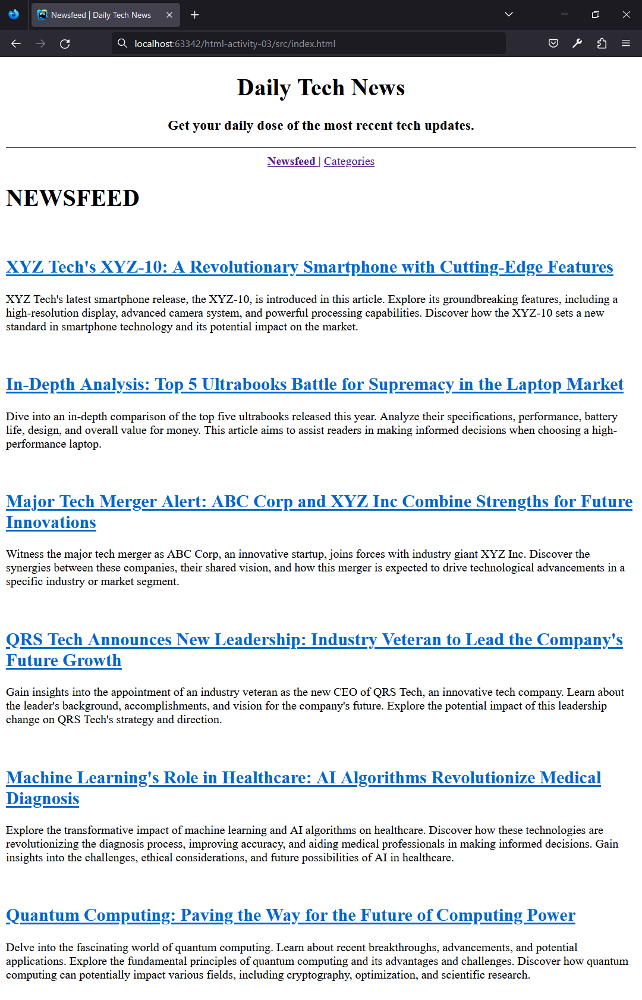
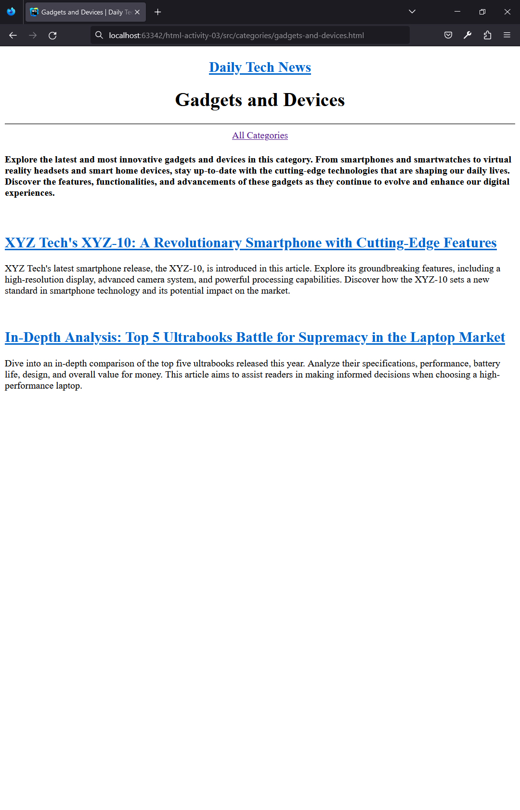
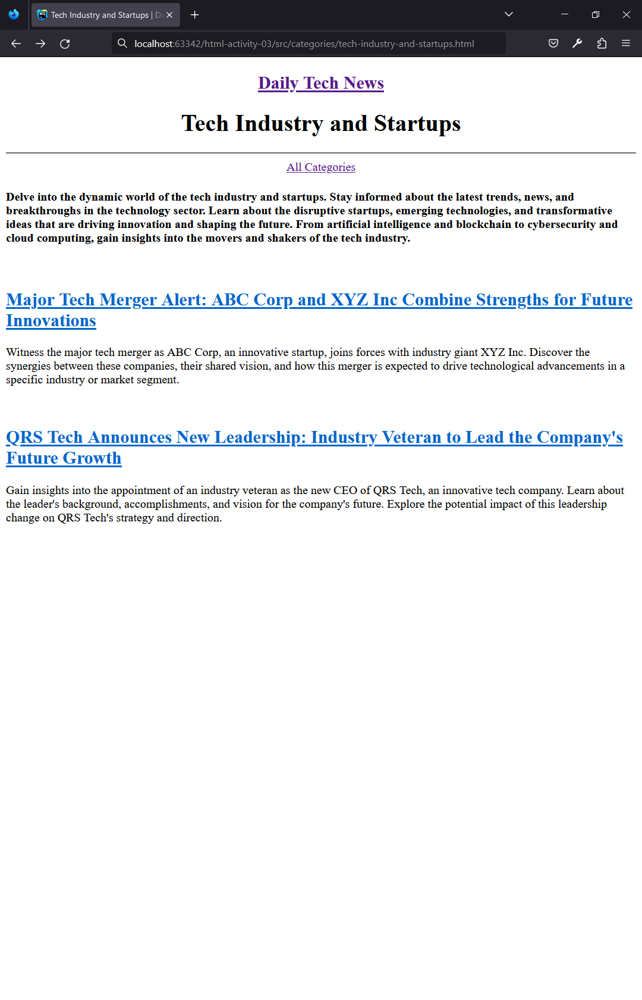
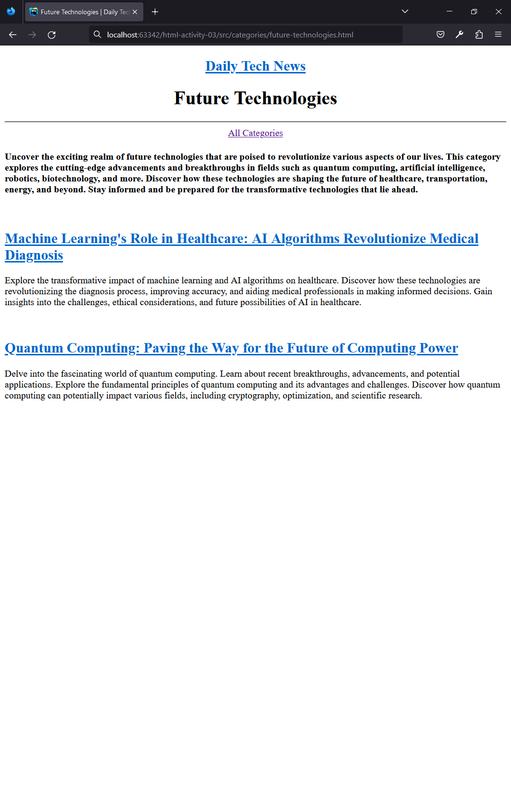
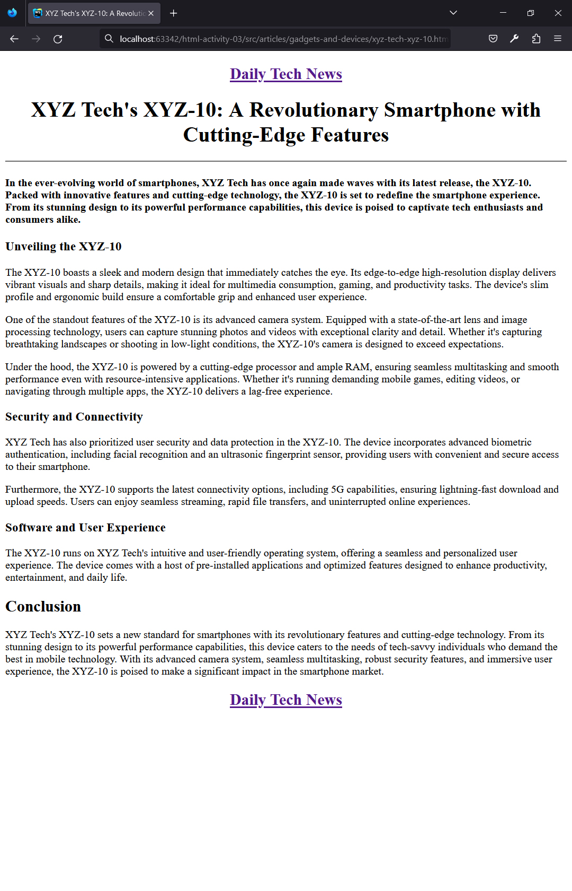
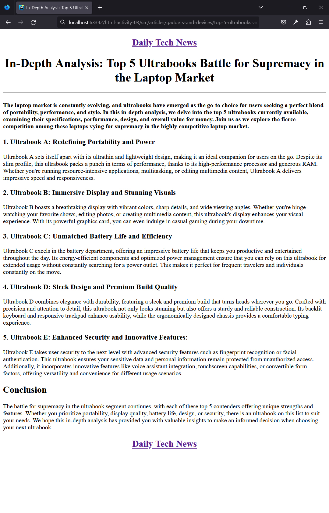
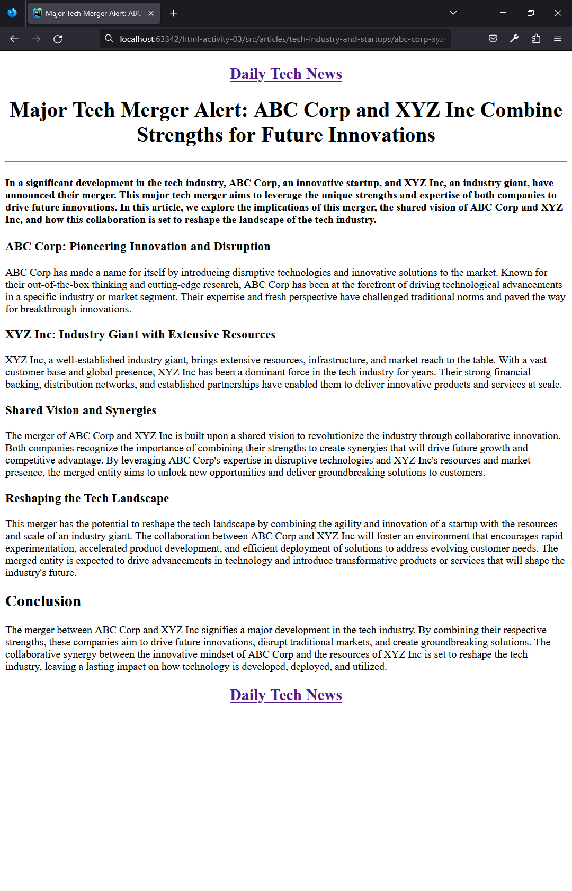
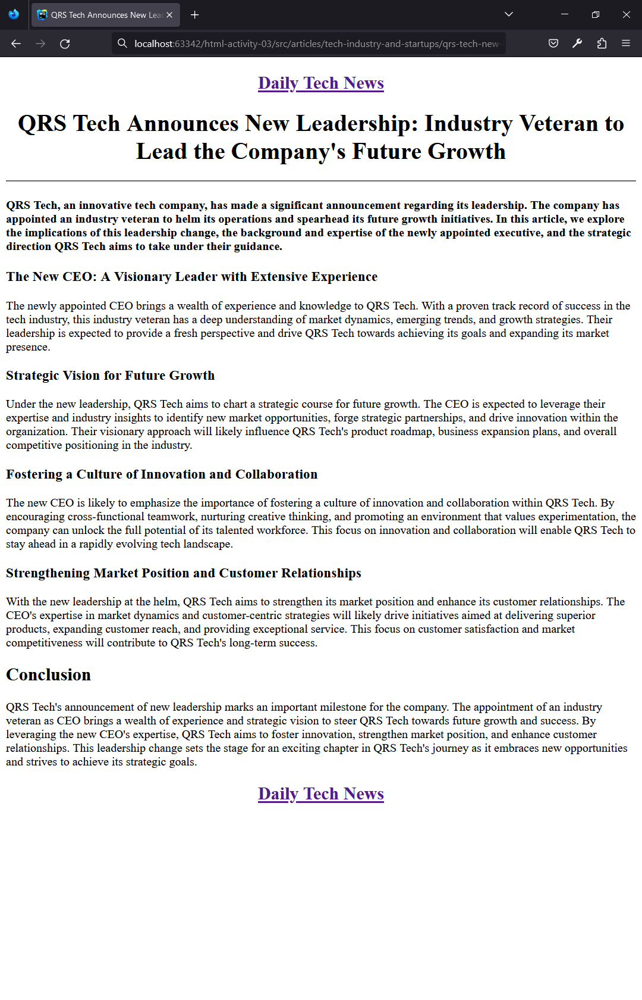
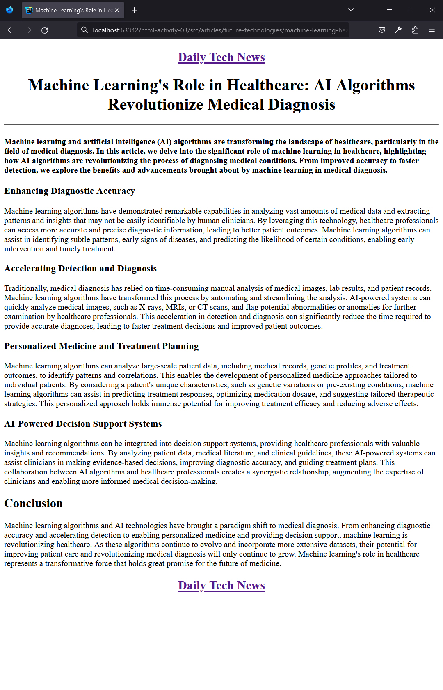
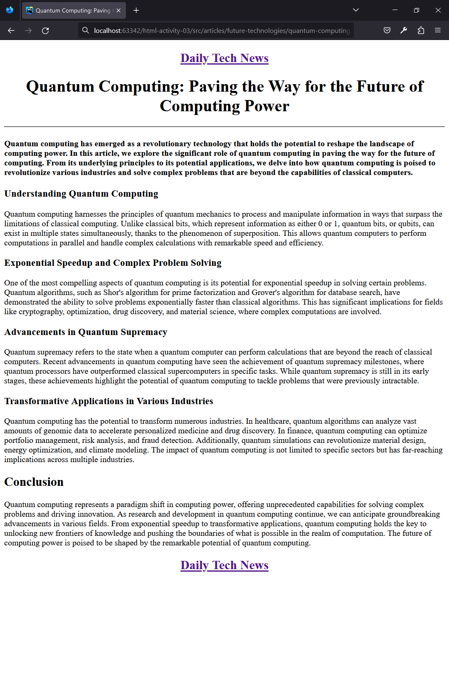

## HTML | Activity #3: Headings, Paragraphs, Attributes and Links
Create a website called **Daily Tech News**.


### Development Setup
Create the necessary files and folders inside the [**src**](/src) folder.
To test your output, simply open any of your html files in your preferred web browser.

#### Folder Structure
```shell
├── src/
│   ├── articles/
│   │   ├── future-technologies/
│   │   │   ├── machine-learning-healthcare.html
│   │   │   └── quantum-computing.html
│   │   ├── gadgets-and-devices/
│   │   │   ├── top-5-ultrabooks-analysis.html
│   │   │   └── xyz-tech-xyz-10.html
│   │   └── tech-industry-and-startups/
│   │       ├── abc-corp-xyz-inc-tech-merger.html
│   │       └── qrs-tech-new-leadership.html
│   ├── categories/
│   │   ├── future-technologies.html
│   │   ├── gadgets-and-devices.html
│   │   └── tech-industry-and-startups.html
│   ├── categories.html
│   └── index.html
```

#### Text Contents
Utilize the provided text contents at [**assets/texts**](assets/texts) to expedite your activity.


### I. Newsfeed `(index.html)`
The **Newsfeed** page lists all the tech news headlines on one page.
There is also a navigation bar for navigating between Newsfeed and Categories.




### II. Categories `(categories.html)`
The **Categories** page lists all news categories on one page.
There is also a navigation bar for navigating between Categories and Newsfeed.

<small>
<b>HINT:</b> To navigate to files in the parent folder, use <b><code>../</code></b> as needed.
</small>


Clicking on a particular category will take the website to the relevant category page,
that lists all tech news headlines for that category and provides links back to **Categories** page.

#### 1. Gadgets and Devices `(categories/gadgets-and-devices.html)`


#### 2. Tech Industry and Startups `(categories/tech-industry-and-startups.html)`


#### 3. Future Technologies `(categories/future-technologies.html)`



### III. News Articles
Clicking on any news link redirects the website to the relevant news article page.
There are also navigation links at the top and bottom that redirects back to **Newsfeed** page.

<small>
<b>HINT:</b> To navigate to files in the parent folder, use <b><code>../</code></b> as needed.
</small>

#### 1. XYZ Tech's XYZ-10: A Revolutionary Smartphone with Cutting-Edge Features
`(articles/gadgets-and-devices/xyz-tech-xyz-10.html)`


#### 2. In-Depth Analysis: Top 5 Ultrabooks Battle for Supremacy in the Laptop Market
`(articles/gadgets-and-devices/top-5-ultrabooks-analysis.html)`


#### 3. Major Tech Merger Alert: ABC Corp and XYZ Inc Combine Strengths for Future Innovations
`(articles/tech-industry-and-startups/abc-corp-xyz-inc-tech-merger.html)`


#### 4. QRS Tech Announces New Leadership: Industry Veteran to Lead the Company's Future Growth
`(articles/tech-industry-and-startups/qrs-tech-new-leadership.html)`


#### 5. Machine Learning's Role in Healthcare: AI Algorithms Revolutionize Medical Diagnosis
`(articles/future-technologies/machine-learning-healthcare.html)`


#### 6. Quantum Computing: Paving the Way for the Future of Computing Power
`(articles/future-technologies/quantum-computing.html)`

